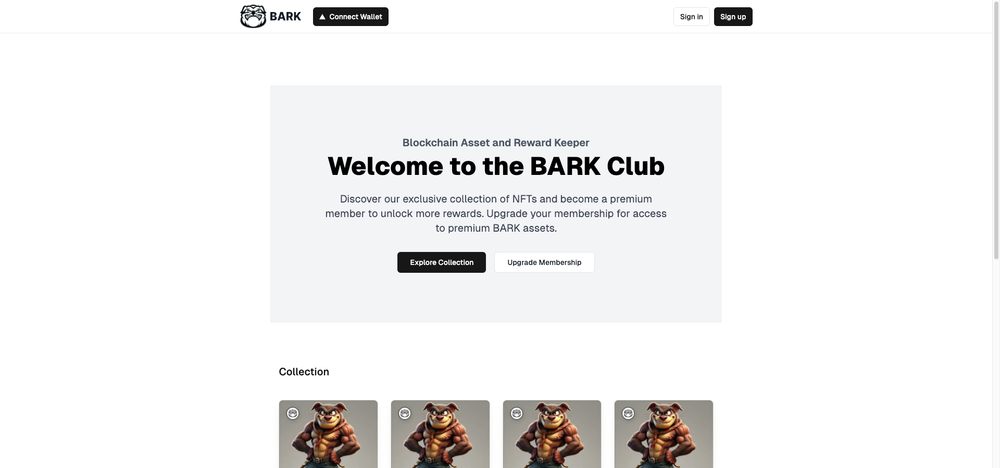

# BARK Protocol | NFT Marketplace

Welcome to the BARK Protocol NFT Marketplace! This project is a comprehensive platform for managing and claiming exclusive BARK and Solana SPL tokens through various airdrop campaigns. Built with Next.js and optimized for performance, it leverages Solana's blockchain technology and Supabase for seamless user authentication and data management.



## Features

- **Explore NFTs:** Discover and view a collection of exclusive NFTs.
- **Mint NFTs:** Mint new NFTs if you are a premium member.
- **Upgrade Membership:** Upgrade to premium to unlock additional features and rewards.
- **Responsive Design:** Fully responsive and optimized for both desktop and mobile views.
- **Theming:** Supports light and dark mode.
- **Supabase Integration:** Auth configured to use cookies with `supabase-ssr`.
- **Styling with Tailwind CSS:** Utility-first CSS framework for styling.
- **Components with shadcn/ui:** Prebuilt UI components for efficient development.

## Frameworks and Technologies

- **Next.js**: Works across the entire stack, including App Router, Pages Router, Middleware, Client, and Server.
- **Supabase**: For authentication and database management, integrated with `supabase-ssr` for cookie-based auth.
- **Tailwind CSS**: For styling the application.
- **shadcn/ui**: For UI components.
- **Vercel**: Deployment platform with automatic environment variable assignment and integration with Supabase.

## Deployment

The project is configured for deployment with [Vercel](https://vercel.com). Environment variables are automatically assigned to the Vercel project during deployment.

## Installation

1. Clone the repository:

   ```bash
   git clone https://github.com/barkprotocol/nft-marketplace.git
   ```

2. Navigate to the project directory:

   ```bash
   cd nft-marketplace
   ```

3. Install the dependencies:

   ```bash
   pnpm install
   # or
   yarn install
   ```

4. Create a `.env.local` file in the root of your project and add your environment variables:

   ```env
   NEXT_PUBLIC_SUPABASE_URL=your-supabase-url
   NEXT_PUBLIC_SUPABASE_ANON_KEY=your-supabase-anon-key
   VERCEL_URL=your-vercel-url
   ```

5. Run the development server:

   ```bash
   pnpm run dev
   # or
   yarn dev
   ```

   Visit `http://localhost:3000` in your browser to see the app in action.

## Usage

- **Explore Collection:** Navigate to `/collection` to view the NFT collection.
- **Mint NFT:** If you're a premium member, visit `/mint` to mint new NFTs.
- **Upgrade Membership:** Access `/upgrade` to upgrade your membership.

## Contributing

We welcome contributions! To contribute:

1. Fork the repository.
2. Create a new branch (`git checkout -b feature/your-feature`).
3. Make your changes.
4. Commit your changes (`git commit -am 'Add new feature'`).
5. Push to the branch (`git push origin feature/your-feature`).
6. Open a Pull Request.

## License

This project is licensed under the MIT License - see the [LICENSE](LICENSE) file for details.

## Acknowledgments

- [Supabase](https://supabase.io/) - Database and authentication.
- [Solana](https://solana.com/) - Blockchain platform.
- [Next.js](https://nextjs.org/) - Framework for React.
- [Tailwind CSS](https://tailwindcss.com/) - Utility-first CSS framework.
- [shadcn/ui](https://shadcn.dev) - UI component library.
- [Vercel](https://vercel.com) - Deployment platform.
